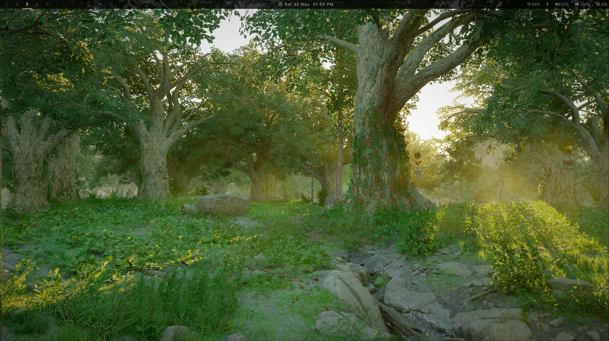
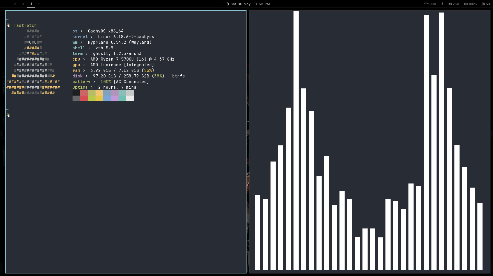
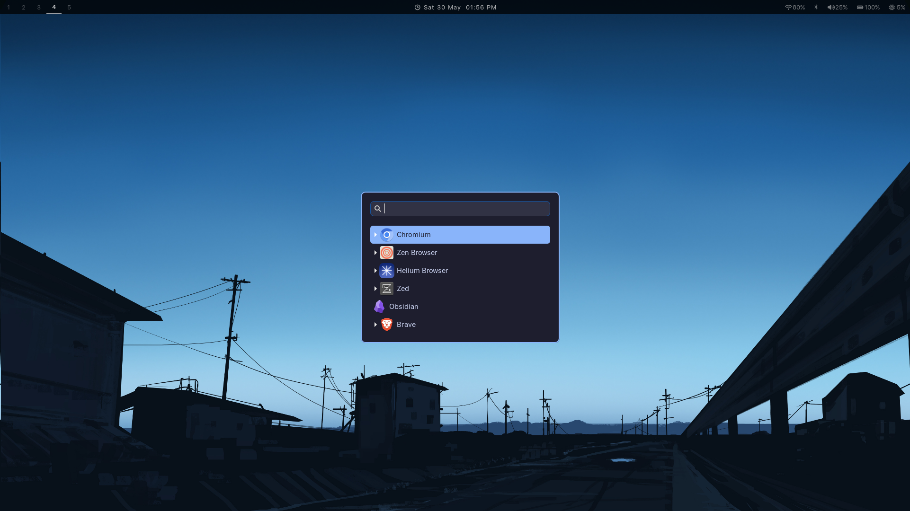
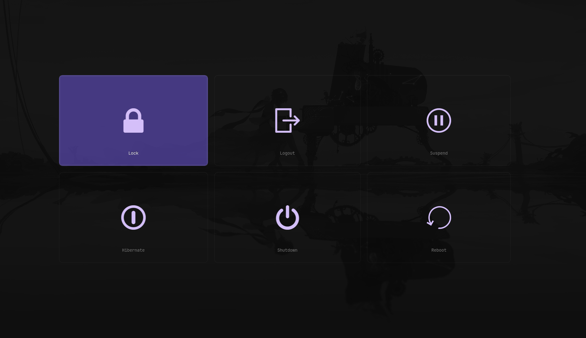

## 📸 Preview










# ✨ Dotfiles

> minimal · fast · clean — my personal hyprland setup on CachyOS


</div>

---

## 📦 What's Included

- 🪟 Hyprland window manager config
- 📊 Waybar status bar
- 🔒 Hyprlock lockscreen
- 🚀 Wofi launcher
- 🔔 Mako notifications
- 🖼️ Swww + Waypaper wallpaper setup
- ⚡ Wlogout power menu
- 🐚 ZSH + Starship prompt
- 📜 Custom scripts (wallpaper, screenshot, screen record)

---

## 🛠 Requirements

- CachyOS / Arch Linux
- Git
- yay (AUR helper)

---

## 🚀 Installation

```bash
# 1. install dependencies
yay -S hyprland waybar kitty wofi wlogout hyprlock hypridle \
    swww waypaper mako starship fastfetch cliphist \
    wl-clipboard grim slurp libinput-gestures wf-recorder

# 2. clone the repo
git clone git@github.com:Goutham-675/DotFiles.git ~/dotfiles

# 3. run install script
cd ~/dotfiles && ./install.sh

# 4. reload hyprland
hyprctl reload
```

---

## ⌨️ Keybinds

| key | action |
|-----|--------|
| `Super + Return` | terminal |
| `Super + D` | launcher |
| `Super + Q` | kill window |
| `Super + L` | lock screen |
| `Super + X` | power menu |
| `Super + W` | random wallpaper |
| `Super + Shift + W` | wallpaper picker |
| `Super + C` | clipboard history |
| `Super + Shift + S` | screenshot |
| `Super + Shift + R` | screen record |
| `Super + B` | toggle waybar |

---

## 🎯 Goal

- quickly bootstrap a new machine
- keep configs version controlled
- consistent environment everywhere
- never lose a setup again

---

## ⚠️ Note

tailored to my personal workflow — feel free to fork and modify.

---

<div align="center">

*"Configure once, use everywhere."*

🐧 built with love on CachyOS

</div>
